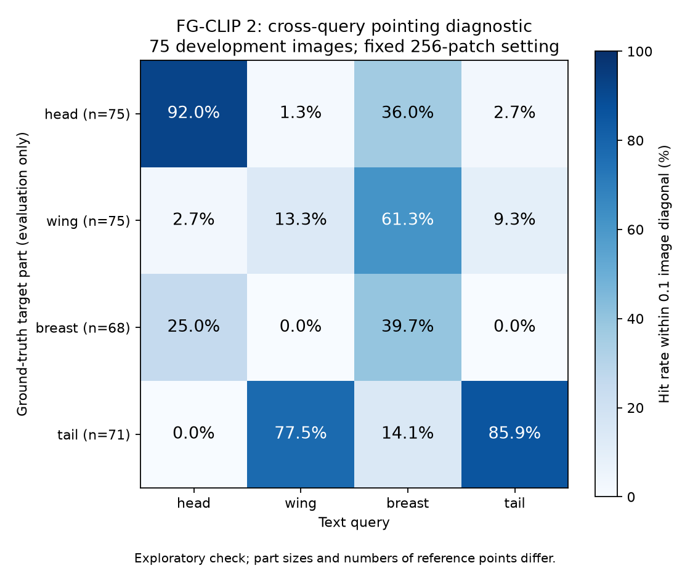

# 属性学习四条路线：论文、实现与本机诊断

日期：2026-09-29。项目：ELEC4240 SpeciesRecognition。

本轮按授权恢复文献核查、源码审计和轻量开发集测试。研究对象为 DEAL、AG-CLIP 原论文、DCLIP/WaffleCLIP、FG-CLIP 2。它们解决的问题不同，不能合并称为一个通用的“AG 模块”。本轮没有重新训练之前五个模型，没有使用最终测试集调参，也没有完成上述论文的完整复现。

## 1. 结论与选择

| 路线 | 属性在哪一层产生作用 | 对本项目的价值 | 已完成的检查 |
|---|---|---|---|
| DEAL | 属性／概念解释图参与训练损失，约束位置差异和整体一致性 | 检查不同属性是否看对位置；必须先验证损失能反传 | 原文与官方 ViT 代码对照；最小梯度审计 |
| AG-CLIP | 属性文字指导找区域，区域与全图表示经过属性编码及 CAF 融合后分类 | 定义完整方法和现有改编的边界 | 主干、区域来源、融合、训练与数据协议逐项复核 |
| DCLIP / WaffleCLIP | 类别文字原型及相似度汇总直接改变类别分数 | 低成本区分真实语义收益和提示集成收益 | 固定 CLIP B/16，500 张开发图片，匹配四提示词预算对照 |
| FG-CLIP 2 | 预训练中已学习区域文字对齐、属性难负例和相近描述区分 | 提供可复用的密集局部特征；不是完全没有属性优化的基线 | 固定版本部署、接口与分类／部位定位诊断，结果见第 5 节 |

结合此前 [DAZLE/TransZero 研究](dazle_transzero_decision_path_2026-09-29.md)，更合理的后续问题是：**先验证局部属性能否被识别，再让这些属性明确参与类别评分，并用语义干预检验分类收益。** 不应把目标设成必须让某个无属性基线变差，或者通过选择随机种子制造显著提升。

## 2. DEAL：看不同的位置，还必须看对位置

依据：[ECCV 2024 论文](https://www.ecva.net/papers/eccv_2024/papers_ECCV/papers/05615.pdf)、[官方实现](https://github.com/deep-real/DEAL)。

DEAL 为类别生成概念描述，计算类别与概念的解释图，在图文对比学习之外，约束概念解释之间的差异，并保持聚合概念解释与类别解释一致。采用 CLIP ViT-B/32 和 RN50。论文 CUB 表中，ViT-B/32 普通全模型微调为 67.5%，DEAL 为 69.6%；对应增益为 2.1 个百分点，不能把对零样本基线 52.6% 的全部提升都归因于 DEAL。

论文的解释图指标和 CUB-Part 分割实验，与我们 CUB 关键点评价并不等价。论文实验也不能直接当作当前类别隔离 GZSL 协议的证据。

### 当前官方 ViT 实现存在必须先处理的梯度问题

审计固定在 commit `3a00f994c0855e3f90e1243791a921591c6623f6`：

- `explainer.py::interpret` 对 `autograd.grad(...)` 的结果和 `blk.attn_probs` 都执行 `detach()`。
- `train.py` 用该解释图计算分离、一致性、稀疏性损失，再将它们加入总损失。
- 因为解释图已经脱离计算图，这些项不能通过该路径更新模型参数。
- 同时，源码的分离项使用重叠乘积，一致性使用解释图之和，并增加稀疏项；不能把源码逐项等同于论文公式。

本机使用 **原样抽取的官方解释函数与损失函数**，在小型可微注意力模型上测试：

| 检查 | 结果 |
|---|---:|
| 官方解释图 `requires_grad` | False |
| 分离＋一致性项 `requires_grad` | False |
| 加入该项前后参数梯度最大差异 | 0 |
| 独立可微候选实现的梯度范数 | 8.15577 |

详见 [审计结果](../reports/four_routes_v1/deal_gradient_audit.json) 和 [脚本](../audit_deal_gradient.py)。候选修改保留注意力计算图，并对梯度求导启用 `create_graph=True`；它只证明最小测试中梯度可以存在，**没有证明完整 CLIP 的二阶梯度、显存、训练稳定性或分类增益已经解决**。该发现针对这个公开提交的 ViT 路径，不代表作者未公开实现或 RN50 路径，也不构成对论文全部结果的否定。

### 对我们的位置诊断意味着什么

解释图分散不等于属性正确。模型可能把四个属性分别放到四块背景上；同一翅膀上的颜色与形状属性又可能合理重叠。因此应同时检查：

1. **位置正确性**：只在部位可见时，测量预测峰值到对应 CUB 关键点的距离，与中心、随机位置、错误部位查询比较。
2. **可区分性**：换掉属性查询后，热图和选中区域是否发生符合语义的变化，而非只看热图是否相互不同。
3. **决策相关性**：遮挡预测区域／交换属性后，相关类别分数应有可解释变化，同时保留随机区域对照。
4. **优化可达性**：每个属性损失都要单独检查对目标参数的非零、有限梯度。

现有 CUB 的 15 个关键点适合 pointing/distance 评价，不应伪称为精确部位分割或直接报告 mIoU。当前优先采用可验证的局部相似度／注意力路径；暂不盲目启动这份官方 ViT 训练脚本。

## 3. AG-CLIP 原论文与当前改编

本文特指 [AG-CLIP: Attribute-Guided CLIP for Zero-Shot Fine-Grained Recognition，2026](https://doi.org/10.1109/OJCS.2026.3654171)，并核对了[作者公开全文](https://www.researchgate.net/publication/399822501_AG-CLIP_Attribute-Guided_CLIP_for_Zero-Shot_Fine-Grained_Recognition)。不是把所有 attribute-guided CLIP 工作统称为此论文。

| 环节 | 原论文描述 | 当前项目实现／差异 |
|---|---|---|
| 主干 | CoCa ViT-L/14 | CLIP B/16、B/32 与 SigLIP 2 等较小主干 |
| 属性来源 | GPT-4o 生成并筛选类别属性 | CUB 属性、公开描述与训练集属性探针；不是同一生成流程 |
| 定位 | OWL-ViT 按属性查询选择 top-K 区域 | 部位提示、最多两个候选区域或既有固定视图，属性与区域不是逐项一一对应 |
| 视觉编码 | 引言写额外编码器和两套视觉编码器；式 (2)–(4) 又写共享视觉编码器，存在歧义 | 较早 grounded_v1 使用复制出的独立属性视觉分支；最近 token 版本使用冻结特征 |
| 属性表示／融合 | 属性聚合、MLP、CAF 与全图交互 | 独立属性 token、探针置信度、有限残差门控；并非原 CAF 的已验证等价实现 |
| 更新目标 | 图文对比学习，并微调视觉语言编码器及新增层 | 最近实验主要更新探针和融合层，保留全图分支；含分类、保持原输出等额外目标 |
| 协议 | CUB 150 seen / 50 unseen 等 | 100 类中的 50 seen / 25 dev-unseen / 25 final-unseen，小样本探索 |

**更正：不能确定地声称原论文必须采用两套独立视觉主干，也不能确定地声称它只采用共享主干。** 引言明确提到额外 CLIP 视觉编码器及两套视觉编码器，而方法公式同时把区域与全图写为共享的 `f_v`。在作者代码或解释得到核实前，应把权重是否共享列为复现待澄清项。

原文的聚合、相加和拼接描述还存在需要澄清的细节：公式使用 `v+a`，另一段写拼接后进入 CAF；属性 token 的具体组织方式也未充分限定。本轮尚未核实到官方作者实现，因此不能把我们选择的一种实现写成严格复现。

原论文报告 CUB ZSL 从 CoCa 的 65.4% 到完整方法的 73.3%；它与当前开发集 GZSL H 不是同一指标、划分或训练预算。复现时还必须明确推理如何构造属性候选池：可使用固定候选类侧信息，不能根据测试图真实类别选择专属属性。

本机可做的是 **AG-CLIP-inspired 可控实现**：小主干、冻结或少量解冻、共享区域编码、明确的融合路径，以及完整负对照。若要声称原论文复现，还缺少唯一可核验的 CAF 细节和匹配的完整实验配置。

## 4. DCLIP / WaffleCLIP：正确属性是否比提示集成更有价值

依据：[DCLIP 论文](https://arxiv.org/html/2210.07183v2)、[作者实现](https://github.com/sachit-menon/classify_by_description_release)、[WaffleCLIP 论文](https://openaccess.thecvf.com/content/ICCV2023/html/Roth_Waffling_Around_for_Performance_Visual_Classification_with_Random_Words_and_ICCV_2023_paper.html)、[作者实现](https://github.com/ExplainableML/WaffleCLIP)。

DCLIP 用类别描述与图像的匹配分数参与分类；WaffleCLIP 通过随机词／字符描述和集成检验提升是否必须依赖准确描述。两者都适合作为冻结视觉语言模型的低成本对照。

### 本轮固定条件

- 冻结 CLIP ViT-B/16；沿用相同全图特征，500 张开发图片，75 个当前候选类。所有指标按类平均。
- 类别名基线一条提示；其他各方法每类四条提示，逐条归一化后平均余弦相似度，不再次归一化均值。
- 描述取官方公开 CUB 描述的前四条，不按结果筛选。三组随机种子只改变文字／打乱关系，不是三次独立训练。
- 随机词来自公开描述词表，另加随机字符；每组随机描述在所有类别间共享，类别名保持正确。数量和词表不同于 WaffleCLIP 官方默认，所以称为 **Waffle-inspired 匹配预算对照**。
- 真实描述由语言模型产生，未经逐图可见性认证；本实验不能回答人工验证的可见属性是否有效。

| 方法 | Seen S | Unseen U | H | 仅未见候选 ZSL |
|---|---:|---:|---:|---:|
| 类别名 | 70.40 | 68.00 | 69.18 | 77.60 |
| DCLIP-inspired，真实四描述 | 72.40 | 67.60 | 69.92 | 76.40 |
| 四个通用模板 | 69.60 | 66.40 | 67.96 | 76.40 |
| 打乱描述，seed 42 | 70.00 | 66.80 | 68.36 | 77.20 |
| 打乱描述，seed 43 | 72.00 | 68.40 | 70.15 | 76.80 |
| 打乱描述，seed 44 | 70.40 | 68.40 | 69.39 | 78.80 |
| 随机词／字符，seed 42 | 72.00 | 66.80 | 69.30 | 74.40 |
| 随机词／字符，seed 43 | 72.40 | 71.20 | 71.79 | 79.20 |
| 随机词／字符，seed 44 | 72.80 | 71.60 | 72.20 | 79.20 |

H = 2SU/(S+U)。Seen/unseen 指本项目类别划分；基础模型预训练数据与 CUB 是否重叠未获排除。真实描述相对类别名增加 **0.74 个百分点 H**；打乱描述平均 H 为 **69.30%**，随机词／字符平均 H 为 **71.10%**。真实描述没有稳定胜过负对照，且 U 和 ZSL 低于类别名基线。本轮不支持“只要加真实属性描述就明显改善未见类识别”。

这也不证明属性永远无用：文字长度、描述质量、图像可见性、视觉表示和汇总方式都可能限制收益。现有结果更支持先验证语义与局部证据，而不是继续增加未经验证的描述数量。数据经过多轮开发使用，不能把本轮最佳数字当作最终泛化结论或显著性证明。

完整提示、来源、脚本哈希及逐类结果：[protocol](../reports/four_routes_v1/semantic_protocol.json)、[results](../reports/four_routes_v1/semantic_results.json)。重新编码的类别名向量与既有基线最大绝对误差为 0。

## 5. FG-CLIP 2：主干候选与本机验证

依据：[论文 v3](https://arxiv.org/html/2510.10921v3)、[官方仓库](https://github.com/360CVGroup/FG-CLIP)、[Base 权重](https://huggingface.co/qihoo360/fg-clip2-base)。

FG-CLIP 2 建立在 SigLIP 2 双编码器上，结合全局图文学习、区域对齐、属性扰动难负样本、跨模态排序和文本模态内对比学习。它提供额外训练过的密集特征头，因此适合研究局部属性；同时，它已经接受细粒度相关训练，不能当作“完全没有属性优化”的模型。

部署固定为 `qihoo360/fg-clip2-base@430fbc8a912c86fd4de601381b6245a0edab22f0`，主体、权重、动态模块缓存均放 E 盘。执行前审阅本地自定义代码，并按 Hugging Face LFS SHA-256 校验权重。

必须正确区分三个文字接口：短类别提示 `walk_type='short'`、64 tokens；长描述 `walk_type='long'`、196 tokens；区域／密集匹配 `walk_type='box'`、64 tokens。英文显式小写；图像使用官方 SigLIP2 处理器，按真实空间形状屏蔽填充 patch。固定 256 patch 是本机起步配置，不等于论文所有自适应高分辨率设置。

本机已完成全图、长文本、区域文字、密集特征及 RoI 特征接口检查，输出均为有限值。模型共 383,803,394 参数，权重约 1.43 GiB。float32、每批 4 张、256 patch 的冻结推理在 RTX 5060 Laptop 8 GB 上可运行；PyTorch 峰值分配约 1.48 GiB、峰值保留约 1.59 GiB。这不包含桌面等其他进程，也不是训练显存需求。最后一次记录中，500 张全图与 100 条类别文字编码约 11 秒，不含下载、模型加载及后续位置诊断，不能当作完整系统端到端耗时或稳定性能基准。

相同 500 张开发图片、相同类别名模板的结果：

| 冻结主干 | Seen S | Unseen U | H | ZSL |
|---|---:|---:|---:|---:|
| CLIP ViT-B/16 | 70.40 | 68.00 | 69.18 | 77.60 |
| SigLIP 2 B/16，修正小写处理 | 78.80 | 72.40 | 75.46 | 78.00 |
| FG-CLIP 2 Base，256 patch | 74.80 | 70.40 | 72.53 | 76.80 |

FG-CLIP 2 相对 CLIP H 增加 3.35 个百分点，相对已有 SigLIP 2 低 2.93 个百分点。**当前起步配置没有理由直接替换已有最强的全图识别基线。** 不同主干的预训练、分辨率和预处理也不同，这只是系统候选比较，不是控制了所有条件的架构或属性贡献消融。

位置测试使用每个开发类别的第一张图，共 75 张；头、翅膀、胸、尾四种查询。真实关键点只用于评分，不作为模型输入。命中范围为原图对角线的 10%。正确／错误查询、中心点和随机网格指标均在运行前确定：

| 目标部位 | 可见样本数 | 正确查询命中率 | 循环错误查询命中率 | 中心点命中率 | 均匀网格期望命中率 |
|---|---:|---:|---:|---:|---:|
| 头 | 75 | 92.00% | 1.33%（查询翅膀） | 44.00% | 12.95% |
| 翅膀 | 75 | 13.33% | 61.33%（查询胸部） | 70.67% | 7.37% |
| 胸 | 68 | 39.71% | 0%（查询尾部） | 45.59% | 6.60% |
| 尾 | 71 | 85.92% | 0%（查询头部） | 4.23% | 6.60% |

头部对应多个关键点，各部位任务难度不同；翅膀是区域而关键点只是一个锚点，低命中率不能直接等同于整个翅膀完全没有被识别。该测试也没有验证颜色、花纹、形状属性。固定第一张开发图的热图复核中，头部峰值靠近头部标注，翅膀查询峰值与尾部查询重合；因此进一步加入了明确标为事后探索的交叉查询检查，未改变模型、提示或主指标。

交叉检查发现：**翅膀与尾部热图的平均 Pearson 相关系数为 0.9601；75 张图中 47 张（62.67%）的两种查询峰值完全相同。** 在尾部可见的 71 张图中，翅膀查询有 55 张（77.46%）指向尾部关键点附近。这个结果比单独的低翅膀命中率更直接地提示了查询间混淆；仍需更准确的区域标注和属性级测试验证。它支持研究 DEAL 的定位／去纠缠问题，但不证明 DEAL 损失一定能修复它。



详细结果：[FG-CLIP 2](../reports/four_routes_v1/fgclip2_results.json)、[逐图关键点评分](../reports/four_routes_v1/fgclip2_pointing_records.json)、[修正后的 SigLIP 2 参考](../reports/four_routes_v1/siglip2_corrected_reference.json)。FG-CLIP 2 的价值目前在于**本机可行的局部特征候选，部分部位已有可测信号**；这尚未证明加入我们的属性方法后会有分类收益。

## 6. 下一阶段的可执行取舍

1. **保留 DCLIP/Waffle 负对照**：任何新的属性文字、融合模块都应与同预算打乱／随机／通用模板比较，不能只比单提示类别名。
2. **用局部指标决定是否训练**：若连部位都找不准，先研究定位和可见性；若部位可定位而颜色形状判别弱，再增加最小差异的属性正负对。
3. **明确属性决策路径**：借鉴 DAZLE/TransZero，让属性分数与固定类别属性档案匹配，同时保留原始主干基线，防止全图强分支掩盖属性是否起作用。
4. **DEAL 先解决计算图问题**：候选可微解释路径必须在真实模型上通过梯度和显存检查后，才值得小规模训练。
5. **按证据使用名称**：当前工作使用“AG-CLIP-inspired adaptation”，不声称完整原论文复现；更换 FG-CLIP 2 带来的变化属于主干差异，不能记作我们新增 AG 的收益。

以上是针对当前数据与资源的研究判断，不预设必然正向结果。冻结推理能否运行与完整微调能否运行是两种不同的可行性结论。

## 7. 复核入口

在项目根目录、已有虚拟环境和既有 CUB 数据／缓存下：

```powershell
.\.venv\Scripts\python.exe -X utf8 prepare_four_routes.py
.\.venv\Scripts\python.exe -X utf8 audit_deal_gradient.py
.\.venv\Scripts\python.exe -X utf8 check_semantic_controls.py
.\.venv\Scripts\python.exe -X utf8 prepare_four_routes.py --fgclip2
.\.venv\Scripts\python.exe -X utf8 check_fgclip2_candidate.py
```

这不是从空电脑开始的一键部署：语义对照依赖已有 CUB100 冻结特征；FG-CLIP 2 依赖已有 manifest 和照片。数据、权重、上游源码副本不进入 Git。固定来源及哈希见 [sources.json](../reports/four_routes_v1/sources.json)，已发表论文与当前公开实现分开解释。
