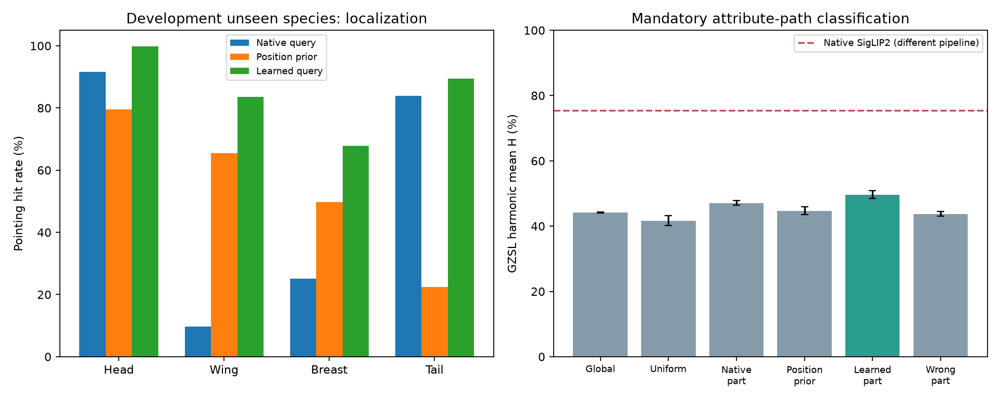

# 属性定位修复与属性分类：本机结果

日期：2026-09-29。完成 3 个定位训练、6 组读出方式 × 3 种子 = 18 个分类训练。全部使用预先固定的更新步数；本轮没有最终测试集评价，没有校准搜索，没有与 SigLIP 2 分数融合。

## 主要结论

**定位混淆明显改善，明确属性路径获得了正向的内部对照结果，但整体仍不如 SigLIP 2。** 修复后属性分支平均 H 为 49.63%，原始定位为 47.10%，错误部位对照为 43.78%。原始 SigLIP 2 在相同开发集的 H 为 75.46%，仍应保留为整体识别基线。

这是采用现有人工关键点和图片属性的监督适配；并非完整 AG-CLIP / DEAL / DAZLE / TransZero 复现，也不能称作系统整体已经超过原模型。

## 1. 定位是否改善

500 张开发图，四种部位平均命中率；命中半径为原图对角线的 10%，只统计可见部位。头部有多个参考关键点，不能将这里的命中率当作分割精度。

| 查询方式 | 全开发集四部位平均 | 开发未见类别四部位平均 |
|---|---:|---:|
| 原始部位文字查询 | 53.65% | 52.59% |
| 训练图固定位置先验 | 55.74% | 54.32% |
| 学习后的部位查询，三种子均值 | 86.55% | 85.17% |

开发未见类别的逐部位结果：

| 部位 | 原始查询 | 学习后，三种子均值 |
|---|---:|---:|
| 头 | 91.60% | 99.87% |
| 翅膀 | 9.76% | 83.60% |
| 胸 | 25.11% | 67.82% |
| 尾 | 83.90% | 89.41% |

翅膀／尾部峰值完全相同的比例，从 62.80% 降到 0.87%（三种子均值）。原始相似度热图的相关系数从 0.9567 降到 0.6025。

这支持“冻结局部特征里有可读出的部位信息，而原始查询存在混淆”的解释；不是依靠固定构图位置就能完全解释的改善。它仍未单独证明颜色、花纹等属性全部被正确识别。

## 2. 定位改善能否进入类别决策

最终类别分数只能由预测属性与固定类别属性档案的兼容性计算，没有逐类别可学习输出头或全图分类旁路。下表为三个种子的均值；± 为训练种子之间的样本标准差，不是数据泛化置信区间。

| 属性分支输入 | Seen S | Unseen U | H（均值 ± 标准差） | ZSL | 属性 mAP |
|---|---:|---:|---:|---:|---:|
| 全图属性读出 | 85.07 | 29.87 | 44.21 ± 0.20 | 58.00 | 41.72% |
| 均匀局部池化 | 80.53 | 28.13 | 41.69 ± 1.48 | 55.73 | 39.18% |
| 原始部位查询 | 86.27 | 32.40 | 47.10 ± 0.68 | 61.73 | 42.04% |
| 固定位置先验 | 84.53 | 30.40 | 44.71 ± 1.15 | 59.73 | 40.95% |
| 修复后的部位查询 | 85.73 | 34.93 | 49.63 ± 1.20 | 63.20 | 42.50% |
| 交换部位后重训 | 86.27 | 29.33 | 43.78 ± 0.67 | 61.60 | 41.82% |

H 为已见／未见宏平均准确率的调和均值；ZSL 只在未见候选类别之间评分。所有读出方式都使用相同的类别属性档案、230 个属性、图片、损失和读出训练预算。learned_part 与 wrong_part 还共享额外的关键点定位训练阶段。

| 修复定位相对对照的 H 差值 | 三种子平均差值 | 探索性配对类别 bootstrap 95% 区间 |
|---|---:|---:|
| 对比全图属性读出 | +5.42 个百分点 | [1.87, 9.15] |
| 对比均匀局部池化 | +7.94 个百分点 | [3.92, 12.61] |
| 对比原始部位查询 | +2.53 个百分点 | [0.41, 4.92] |
| 对比固定位置先验 | +4.92 个百分点 | [2.05, 8.25] |
| 对比交换部位后重训 | +5.85 个百分点 | [2.71, 9.59] |

三个种子对上述每一种对照的 H 差值均为正。区间在既定训练模型上，按已见／未见类别配对重采样，不能涵盖重新训练、重新划分类别和研究者反复查看开发集带来的不确定性；不是独立测试集上的确认性显著结果。

所有分支使用官方 CUB 类别属性档案，这比类别名基线多了基准语义信息。相对原始 SigLIP 2 的差异混合了主干、语义资源、训练及决策方式，不能全部归因于属性定位。

## 3. 剩余瓶颈

修复定位后的属性分支仍明显偏向已见类别；即使只在未见候选中评价，ZSL 也仍低于原始 SigLIP 2。因而问题并非只剩一个已见／未见分数偏置。定位改善幅度很大，而属性 mAP 改善较小，提示细粒度属性证据及类别属性档案的读出仍是瓶颈。

当前更适合保留两条独立结果：强全图模型的识别能力，以及可解释属性分支的定位与机制验证。下一步若扩展 TransZero 式属性查询交互，应固定已修复的定位条件和现有对照，检验细属性读出，而不是把本轮结果直接写成完整 TransZero 或 AG-CLIP 的成绩。

## 4. 部署与验证

三个机制单元测试通过：填充 patch 不参与定位；修改开发关键点不会改变训练得到的位置先验；清零属性证据后不存在视觉到类别的旁路。属性列和类别档案列同时重命名保持分数不变，只打乱一侧则是依赖性干预。

已导出三个不含训练图片／逐图标注的推理包。单张图片从头编码、加载定位器与属性读出，再与缓存评价比较；属性分数最大误差及原始 SigLIP 2 并行结果见 [deployment_check.json](deployment_check.json)。该单图是固定第一张开发图，只用于接口一致性验证，不作为准确率证据。

运行与设计：[说明](../../docs/attribute_path_v1.md)。完整原始结果：[定位](localization.json)、[分类](classification.json)、[分析与区间](analysis.json)。

